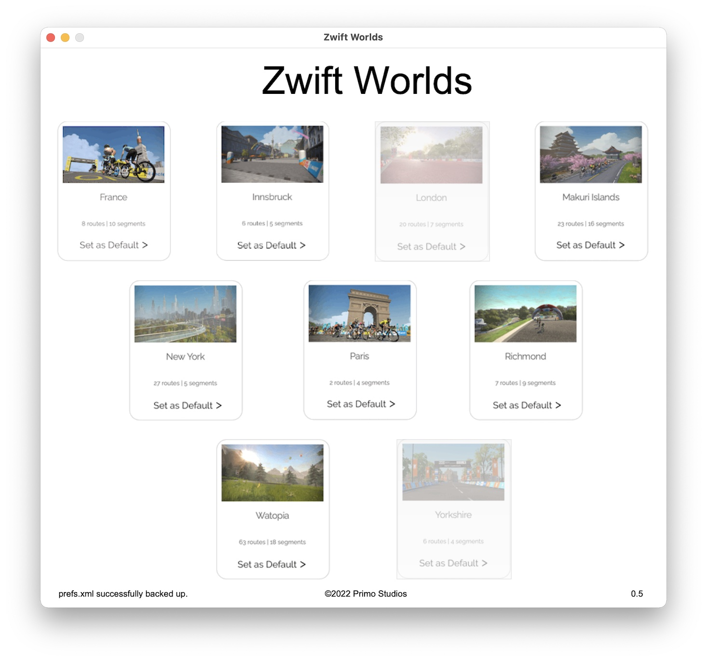

# Zwift Worlds

Simple python GUI app (OS X only for now) that allows you to select any world in Zwift and make it your home world. Will launch Zwift with the selected world as the default HOME WORLD.

## Release Notes

### v0.5

- Updated to grab active Zwift guest worlds from internet and disable selection of active guest worlds in UI

### v0.4

- Added method to backup prefs.xml on launch
- Added option to menu to restore backed up prefs.xml in case the prefs file gets corrupted.

### v0.3

- Initial release
- Displays all Zwift worlds in simple UI. User can select any world in UI and set their default world to selected world, 
  then automatically launch Zwift.